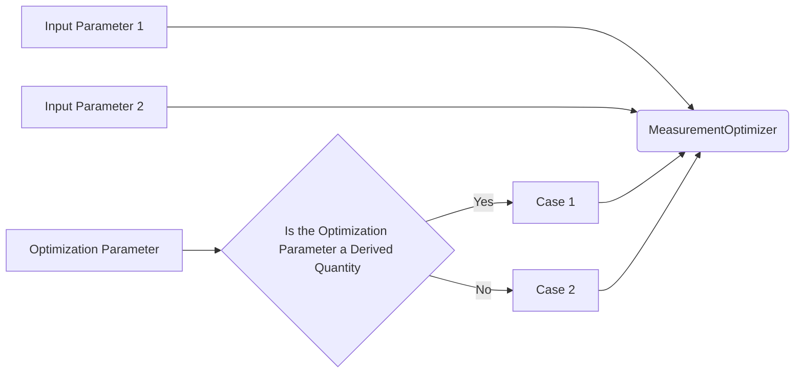

## Summary:

This code allows one to do optimized parameter sweeps for Quantum Computing/Information experiments using systems integrated through Labber API


## Use Cases:




## Usage

The program would require the following inputs:

- 2 parameters, their config. with Labber, and bounds to form the search space
- 1 parameter, its qualifier (`isDerivedQuant: bool`), and associated config. to optimize over
- hyper-parameters for optimization

Example:

```python
from MeasurementOptimizer import *

MeasurementOptimizer()
```


### To Do:

- [ ] study James' code
    - [ ] methods to deal with generalized output optimization
    - [ ] obj code verification
    - [ ] save data
    - [ ] implement SNR optimization
- [ ] test
    - [ ] toy
    - [ ] with system
- [ ] document
- [ ] 3 param  opt.

